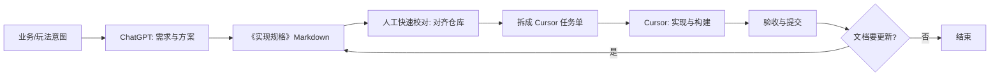

# 从需求文档到 Cursor 实现：C++/Vulkan 引擎协作规范

正文排版遵循 [中文文案排版指北](chinese-typography.md)；文内代码示例遵循 [C++ 编码风格参考](../reference/cpp-style.md)。

本文约定：**在 ChatGPT（或其它对话式大模型）侧产出结构化需求/设计说明**，再在 **Cursor** 中按任务拆解实现与审查。适用于本仓库这类 **C++23 + Vulkan 1.4 + SDL3** 引擎与工具开发。

若**不经过 GPT**、从需求到提交都在 Cursor 内完成，见 [Cursor 内从设计到交付：全流程指南](cursor-end-to-end-workflow.md)（规格落盘、拆单、构建与验收与本文可衔接）。

---

## 1. 为什么要分两段

| 阶段 | 适合由 ChatGPT 承担 | 适合由 Cursor 承担 |
|------|---------------------|-------------------|
| 角色 | 澄清产品意图、罗列方案对比、起草接口与数据流 | 读真实代码树、改 CMake、补测试、对齐现有命名与风格 |
| 优势 | 长上下文讨论、多方案草稿快 | 仓库感知、多文件编辑、终端构建与诊断 |
| 风险 | 易与真实 API/目录结构脱节 | 若输入文档含糊，易实现偏题或重复造轮 |

**原则**：ChatGPT 产出「可验证的规格」，Cursor 在「仓库事实」上落地；衔接靠**固定章节结构 + 显式约束 + 可勾选验收项**。

---

## 2. 推荐端到端流程



1. **意图**：你用自然语言说明要做什么（性能目标、平台、是否破坏兼容）。
2. **ChatGPT**：按第 4 节模板输出《实现规格》。
3. **人工校对**（建议 5～15 分钟）：对照第 5 节清单，把类名、路径、已有子系统改成**仓库里真实存在**的引用。
4. **拆单**：按第 6 节切成 1～3 天能完成的 Cursor 任务。
5. **Cursor**：实现、本地编译、按验收项自检。
6. **提交**：遵循 [Git 提交规范](../guides/git-commit-convention.md)。

---

## 3. 交给 ChatGPT 的「约稿提示」要点

复制下面骨架，按需填空发给 ChatGPT（可中英文混合）：

```text
你正在协助一个 C++23 + Vulkan 1.4 + SDL3 的游戏/引擎项目。

【目标】<一句话目标>
【非目标】<明确不做什么>
【约束】
- 平台：Windows 为主 / 是否跨平台
- 渲染：Vulkan 1.4（实例/设备 API 版本、Features2/Properties2 链等）；与现有 RenderGraph/Pass 的关系：<说明或「待阅读仓库」>
- 性能预算：<例如帧内 CPU 上限、是否多线程录制>
- 兼容：是否允许 BREAKING CHANGE

【输出要求】
请严格按我提供的 Markdown 模板输出《实现规格》，包含：背景、术语、API/数据结构设计、与现有模块的边界、同步与资源生命周期、错误处理、测试与验收标准、风险与回滚。
不要编造本仓库不存在的路径；若未知请写「待仓库确认」并列出要在 Cursor 里 @ 的文件类型。
```

这样可把 ChatGPT 从「乱写代码」引导到「写可对接的规格」。

---

## 4. 《实现规格》文档必备章节

建议文件名：`docs/design/<功能名>-spec.md` 或仓库根目录 `specs/<feature>.md`。ChatGPT 输出应至少包含：

### 4.1 元信息

- **状态**：草稿 / 已定稿 / 已实现
- **作者与日期**
- **相关 Issue / 讨论**（若有）

### 4.2 背景与目标

- 要解决什么问题；**成功是什么样**（可观察行为或指标）。

### 4.3 非目标与假设

- 明确排除的需求；对驱动版本、GPU 能力、单线程等的假设。

### 4.4 用户可见行为 / 对外 API（若适用）

- 公共头文件拟放置位置（**需与仓库约定一致**，不确定则标注待确认）。
- 函数签名级别描述即可，**实现细节留给 Cursor**。

### 4.5 内部设计

- **数据流**：谁创建、谁拥有、谁销毁（尤其 `VkDevice`、`VkImage`、`VkBuffer`、VMA allocation）。
- **线程模型**：是否在非图形线程提交、是否需 `VkFence`/`mutex`。
- **与 RenderGraph / Pass / Pipeline 的关系**：新 Pass 还是扩展现有类。

### 4.6 Vulkan 专项（引擎类需求必写）

- **同步**：image acquire、queue submit、present、barrier 的粗略顺序；与 swapchain 重建的交互。
- **资源生命周期**：与 `wait_idle`、帧内复用、per-frame allocator 的关系。
- **着色器**：GLSL/HLSL 源路径约定、SPIR-V 产物如何进 `get_resource_path`。
- **坐标与投影**：是否涉及 NDC Y、深度范围、`frontFace`（可引用 [GLM 与 Vulkan](../reference/glm-vulkan.md)）。

### 4.7 错误处理与日志

- 失败时是 `assert`、返回 `bool`/`std::expected`，还是抛异常（与项目风格一致）。
- 日志宏层级建议（参见 [日志系统](../reference/logging.md)）。

### 4.8 测试与验收标准（可勾选）

- **构建**：Debug/Release 配置下 CMake 无警告策略（按项目现状）。
- **运行**：启动哪个 target（如 `sandbox` / `demo3d`）、如何肉眼或数据验证。
- **回归**：不应破坏的场景列表。

### 4.9 风险、迁移与回滚

- 破坏性变更说明；特性开关或分支策略。

### 4.10 待仓库确认项（显式列表）

- 例如：「`lumen::renderer::Foo` 是否已存在」「depth 格式与当前 swapchain 是否一致」——方便你在 Cursor 里逐项 `@` 查证。

---

## 5. C++23 / Vulkan 1.4 校对清单（交给 Cursor 之前过一遍）

在把规格丢给 Cursor 前，人工或让 ChatGPT「二次对照」下列项，减少幻觉：

- [ ] **包含与链接**：新 .cpp 是否加入 CMake 目标；是否需要新第三方库（优先复用现有）。
- [ ] **头文件层级**：是否破坏「渲染不依赖具体游戏逻辑」等分层（参考 [项目注意事项](../guides/project-notes.md)、现有设计文档）。
- [ ] **SPIR-V 与路径**：是否写明编译步骤与运行时路径（与 [快速参考](../guides/quick-reference.md) 中 `get_resource_path` 一致）。
- [ ] **Swapchain / 窗口**：resize、最小化、out-of-date 时行为是否与现有 `recreate_swapchain_resources` 一类流程兼容。
- [ ] **同步**：是否重复 `wait_idle` 造成卡顿；barrier 是否覆盖所有 layout 转移。
- [ ] **数学与 handedness**：透视矩阵与 `frontFace` 是否与 [GLM 与 Vulkan](../reference/glm-vulkan.md) 一致。
- [ ] **命名空间与风格**：与 [C++ 编码风格](../reference/cpp-style.md) 一致（本仓库为 **C++23**）。
- [ ] **Vulkan 版本与链式结构**：是否与 **Vulkan 1.4** 及 `Features2`/`Properties2` 链用法一致（参见 `lumen::render::Context` 等实现）。

---

## 6. 拆给 Cursor 的任务单规范

不要把整份 50 页规格一次性丢进 Agent。推荐每张任务单包含：

### 6.1 任务单模板（复制到 Cursor Chat/Composer）

```text
【上下文】
- 规格文档：@docs/design/xxx-spec.md （或 @ 具体章节）
- 相关代码：@path/to/A.cpp @path/to/B.h

【本任务范围】
- 只做：<列表>
- 明确不做：<列表>

【约束】
- C++23 与代码风格：与仓库一致；Vulkan 目标为 1.4
- 不新增未在规格中批准的依赖

【完成定义】
- [ ] 构建通过
- [ ] <验收项引用规格第 x 节>
- [ ] 提交信息符合 [Git 提交规范](git-commit-convention.md)

【若受阻】
- 列出缺失信息，并建议在规格中增补哪一小节
```

### 6.2 粒度建议

- **单 PR / 单任务**：一次改动围绕一个 `feat(scope):` 主题；大功能拆成「数据结构与 API 壳 → Vulkan 资源 → Pass 接入 → 示例程序」多步。
- **每步可构建**：避免中间状态无法编译（除非规格明确允许 feature flag）。

---

## 7. Cursor 使用习惯（与本仓库）

- **先 @ 规格再 @ 代码**：让模型以「已定约束」为主，以现有实现为参照。
- **长设计文档**：可只 @ 相关章节；超大文件可拆规格（ChatGPT 输出时就分文件）。
- **构建与测试**：在 Agent 模式下允许运行 CMake 构建；失败时把**完整错误输出**贴回对话或写入 `NOTES` 临时说明。
- **项目规则**：若有 `.cursor/rules` 或 `AGENTS.md`，与本文档互补；冲突时以**仓库内已定规则**为准。

---

## 8. 文档与代码同步

- 规格中「已定稿」的对外 API，应在合并实现后更新**简短**模块说明（避免重复粘贴大段代码）。
- 若实现偏离规格，**二选一**：改代码贴合规格，或更新规格并记录原因（避免以后 Cursor/人类都误判）。

---

## 9. 附录 A：ChatGPT 输出用 Markdown 骨架

```markdown
# <功能名称> 实现规格

| 字段 | 值 |
|------|-----|
| 状态 | 草稿 |
| 引擎 | C++23 / Vulkan 1.4 / SDL3 |

## 1. 背景与目标
## 2. 非目标与假设
## 3. 对外行为与 API
## 4. 内部设计与数据流
## 5. Vulkan：同步、资源、着色器
## 6. 错误处理与日志
## 7. 测试与验收标准
## 8. 风险与回滚
## 9. 待仓库确认项
```

---

## 10. 附录 B：与现有文档的关系

| 文档 | 用途 |
|------|------|
| [渲染引擎路线图](../design/render-engine-roadmap.md) / [design/](design/) 下专题 | 总体规划与专题设计；新规格应与之对齐或显式说明差异 |
| [快速参考](../guides/quick-reference.md) | 常用 API 与可执行目标 |
| [项目注意事项](../guides/project-notes.md) | 工程注意事项 |
| [Git 提交规范](../guides/git-commit-convention.md) | 提交格式 |
| [Cursor 全流程](cursor-end-to-end-workflow.md) | 不经过 GPT 时，从设计到提交 |

---

**总结**：ChatGPT 负责把问题想清楚并写成**结构化、可验收**的规格；你负责**对齐仓库事实**；Cursor 负责**在真实代码上小步实现**。中间靠模板与清单保证不脱节。

