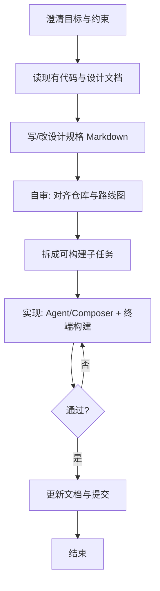

# Cursor 内从设计到交付：全流程指南

正文排版遵循 [中文文案排版指北](chinese-typography.md)；代码与 API 示例风格见 [C++ 编码风格参考](../reference/cpp-style.md)。

本文描述**不依赖外部对话工具**、在 **Cursor** 中完成「澄清需求 → 设计落盘 → 实现 → 验证 → 提交」的推荐做法。若你习惯先用 ChatGPT 起草规格，再进 Cursor，可对照 [ai-assisted-workflow.md](ai-assisted-workflow.md)，二者可衔接：GPT 产出的规格同样适用下文「设计落盘」之后的步骤。

---

## 1. 与另一条工作流的关系

| 路径 | 说明 |
|------|------|
| **全程 Cursor** | 需求、设计、拆单、编码、构建均在 Cursor 内完成（本文）。 |
| **GPT + Cursor** | 规格可在外部起草，进入仓库后仍按本文 **§3～§7** 做校对、拆单与交付。 |

项目规则见仓库 `.cursor/rules/`；技术栈以 **C++23**、**Vulkan 1.4**、**SDL3** 为准。

---

## 2. 端到端总览



---

## 3. 澄清需求（在 Cursor 里完成）

在开启大改前，用对话把以下内容写清楚（可贴在 Issue、规格文档开头或 Chat 首条消息）：

- **要达成什么**：可观察行为、性能或兼容性结果。
- **非目标**：明确不做的范围，避免 scope 膨胀。
- **约束**：是否破坏 ABI/API、是否必须兼容 Windows 当前构建、是否 touch Vulkan 同步或 swapchain 等高风险区。
- **参考**：@ 相关头文件、`docs/design/` 下专题、[project-notes.md](project-notes.md)、[quick-reference.md](quick-reference.md)。

---

## 4. 设计落盘

1. **先读仓库事实**：用 `@` 引用模块目录（如 `engine/include/render/`）、现有设计与 [render-engine-roadmap.md](../design/render-engine-roadmap.md)，避免重复造轮或与分层冲突。
2. **新建或更新设计文档**：建议路径 `docs/design/<主题>-spec.md`（或扩写已有专题）。至少包含：背景、对外行为或 API 边界、数据流与资源生命周期、**Vulkan 1.4 相关**（同步、pass、扩展）、错误处理、**可勾选验收项**。
3. **与路线图对齐**：大功能应对照路线图/功能清单（[render-engine-features.md](../design/render-engine-features.md)），必要时同步勾选或调整优先级说明。

设计阶段不必写满实现细节；**足以让实现者（包括未来的你）在不猜的前提下开工**即可。

---

## 5. 设计自审清单（实现前 10～20 分钟）

- [ ] 提到的类型、命名空间、路径在仓库中**存在或可合理新增**（与 `lumen::` 分层一致）。
- [ ] **SPIR-V / 资源路径**与 `get_resource_path`、CMake 着色器规则一致（见 [quick-reference.md](quick-reference.md)）。
- [ ] **Swapchain / resize / fence / semaphore** 与现有模式兼容（见 [project-notes.md](project-notes.md)）。
- [ ] **GLM / NDC / frontFace** 若涉及，已对照 [glm-vulkan.md](../reference/glm-vulkan.md)。
- [ ] 大重构已拆步，且接受「中间状态尽量可编译」（与 `.cursor/rules` 中原则一致）。

更细的 Vulkan/规格项也可参考 [ai-assisted-workflow.md](ai-assisted-workflow.md) §5。

---

## 6. 拆任务与实现节奏

1. **按垂直切片拆单**：优先「能跑通一小条路径」的增量（例如先 API 与数据结构，再 Vulkan 资源，再接入 Pass/示例），避免一次 diff 过大。
2. **每条任务携带上下文**：在 Composer/Agent 中明确 `@docs/design/...`、相关 `.hpp/.cpp`，并写清「本步做 / 本步不做」。
3. **频繁构建**：每完成一步运行 `cmake --build`（配置见根目录 [README.md](../../README.md)）；错误信息完整贴回对话或写入临时笔记再改。
4. **大重构**：允许大范围修改，但尽量分提交或分 PR，并在规格或 PR 说明中写动机与风险（参见项目规则）。

---

## 7. 验证与收尾

- **运行**：对应用例目标（如 `sandbox` / `demo3d` / `shadertoy`），按规格中的验收项勾选。
- **图形**：Debug 下建议开 Validation，关注与同步、layout、descriptor 相关的报错。
- **日志**：引擎内 `LUMEN_LOG_*`，应用侧 `LUMEN_APP_LOG_*`（见 [logging.md](../reference/logging.md)）。
- **文档**：公开行为或配置有变时，更新对应 `docs/` 小节；勿在正文写「合并版」类元信息。
- **提交**：遵循 [git-commit-convention.md](git-commit-convention.md)（Conventional Commits + 必填 `scope`）。

---

## 8. 附录：单步任务模板（粘贴到 Cursor）

```text
【设计依据】@docs/design/<xxx>-spec.md 第 x 节

【本步范围】
- 实现：……
- 不做：……

【约束】C++23、Vulkan 1.4、与现有 Context/同步模式一致；不引入未批准依赖。

【完成定义】
- [ ] Debug/Release 构建通过
- [ ] 规格第 x 节验收项满足
- [ ] 提交信息符合 git-commit-convention
```

---

**小结**：全程在 Cursor 时，**设计必须落盘在 `docs/design/` 并与代码同步迭代**；实现阶段靠 **小步 + 构建反馈 + 清单验收**，与「GPT 写规格」路径共用同一套交付标准。
