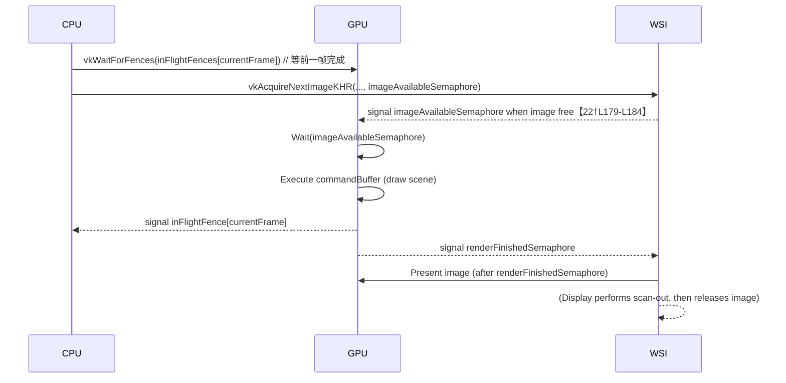
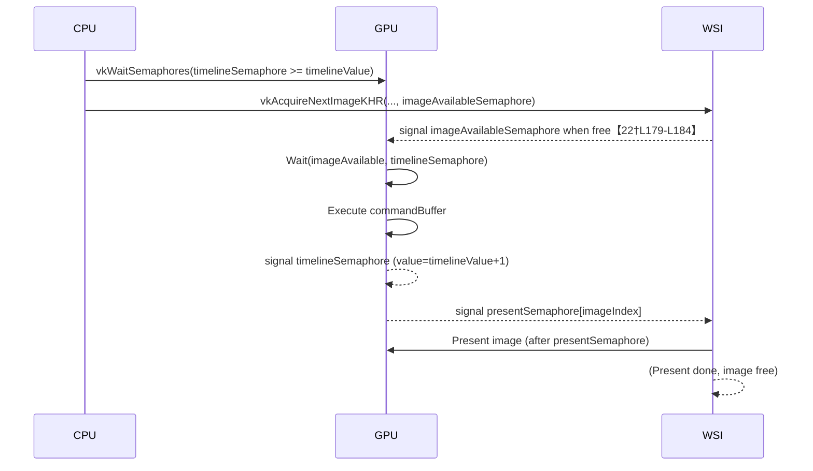

# 摘要

本文对比总结了 Vulkan 中的两种主要同步方案：**经典方案**（Binary 信号量 + Fence + `imagesInFlight`）和**混合时间线方案**（仅用二进制信号量进行交换链同步，使用时间线信号量进行 CPU↔GPU 及 GPU↔GPU 同步）。针对每种方案，我们分别说明其目的、所需同步对象和数据结构、初始化与渲染循环代码模板、关键时序（文字+时序图）、常见错误及验证层报错与解决方法、性能与复杂度对比，以及适用场景。文末给出两种方案的对比表格和示例代码片段，并提供从经典方案逐步迁移到时间线方案的路线图与检查清单。

## 经典方案：Binary Semaphore + Fence + `imagesInFlight`

### 1. 目的

经典多帧并行（Frames-In-Flight）方案的目标是在 CPU 和 GPU 之间实现并行渲染：允许 CPU 在 GPU 渲染上一帧时提前准备下一帧。为此，需要对**交换链图像生命周期**和**帧间同步**进行管理：

- **CPU↔GPU 同步**：使用 `VkFence` 在主机端等 GPU 完成当前帧（避免资源重写）。  
- **GPU↔GPU 同步**：使用二进制 `VkSemaphore` 在渲染管线和呈现操作之间同步。  
- **交换链图像管理**：用 `imagesInFlight` 数组记录每个 swapchain 图像目前被哪个 frame（fence）占用，防止同一图像同时被多个帧使用。

### 2. 成员变量 / 数据结构

- `MAX_FRAMES_IN_FLIGHT`：帧数（例如 2 或 3）。  
- `std::vector<VkCommandBuffer> commandBuffers`：每帧一个命令缓冲区（或使用每图像一个命令缓冲）。  
- `std::vector<VkSemaphore> imageAvailableSemaphores`（大小 = 帧数）：图像可用信号量，用于 `vkAcquireNextImageKHR`。  
- `std::vector<VkSemaphore> renderFinishedSemaphores`（大小 = 帧数）：渲染完成信号量，用于提交后通知呈现。  
- `std::vector<VkFence> inFlightFences`（大小 = 帧数）：帧同步围栏，CPU 等待此 fence 来保证前一帧完成。  
- `std::vector<VkFence> imagesInFlight`（大小 = 交换链图像数）：记录当前每个交换链图像对应的 fence（若图像正被使用，则指向该帧的 fence）。  

> **解释**：`imagesInFlight[imageIndex]` 初始为 `VK_NULL_HANDLE`。当帧使用一个图像时，将该帧的 fence 存入 `imagesInFlight[imageIndex]`。在下一次获取同一图像时，如果对应的 fence 未 `VK_NULL_HANDLE`，则先 `vkWaitForFences` 等待该 fence，确保 GPU 已完成对该图像的使用。  

### 3. 初始化代码模板

```cpp
const int MAX_FRAMES_IN_FLIGHT = 2; // 多帧数
// 创建同步对象
imageAvailableSemaphores.resize(MAX_FRAMES_IN_FLIGHT);
renderFinishedSemaphores.resize(MAX_FRAMES_IN_FLIGHT);
inFlightFences.resize(MAX_FRAMES_IN_FLIGHT);
imagesInFlight.resize(swapchainImageCount, VK_NULL_HANDLE);

VkSemaphoreCreateInfo semInfo = {};
semInfo.sType = VK_STRUCTURE_TYPE_SEMAPHORE_CREATE_INFO;
VkFenceCreateInfo fenceInfo = {};
fenceInfo.sType = VK_STRUCTURE_TYPE_FENCE_CREATE_INFO;
// 初始为“信号状态”，便于第一次等待时立即通过
fenceInfo.flags = VK_FENCE_CREATE_SIGNALED_BIT;

for (int i = 0; i < MAX_FRAMES_IN_FLIGHT; i++) {
    vkCreateSemaphore(device, &semInfo, nullptr, &imageAvailableSemaphores[i]);
    vkCreateSemaphore(device, &semInfo, nullptr, &renderFinishedSemaphores[i]);
    vkCreateFence(device, &fenceInfo, nullptr, &inFlightFences[i]);
}
```

### 4. 渲染循环（`drawFrame()`）代码模板

```cpp
void drawFrame() {
    // 1. 等待当前帧完成
    vkWaitForFences(device, 1, &inFlightFences[currentFrame], VK_TRUE, UINT64_MAX);
    vkResetFences(device, 1, &inFlightFences[currentFrame]);

    // 2. 获取下一个交换链图像
    uint32_t imageIndex;
    vkAcquireNextImageKHR(device, swapchain, UINT64_MAX,
                          imageAvailableSemaphores[currentFrame], VK_NULL_HANDLE,
                          &imageIndex);

    // 3. 如果该图像被前一帧占用，等待前一帧完成
    if (imagesInFlight[imageIndex] != VK_NULL_HANDLE) {
        vkWaitForFences(device, 1, &imagesInFlight[imageIndex], VK_TRUE, UINT64_MAX);
    }
    // 4. 标记当前帧使用该图像
    imagesInFlight[imageIndex] = inFlightFences[currentFrame];

    // 5. 录制命令缓冲区（使用 imageIndex ）
    vkResetCommandBuffer(commandBuffers[currentFrame], 0);
    recordCommandBuffer(commandBuffers[currentFrame], imageIndex);

    // 6. 提交到队列
    VkSemaphore waitSemaphores[] = { imageAvailableSemaphores[currentFrame] };
    VkPipelineStageFlags waitStages[] = { VK_PIPELINE_STAGE_COLOR_ATTACHMENT_OUTPUT_BIT };
    VkSemaphore signalSemaphores[] = { renderFinishedSemaphores[currentFrame] };

    VkSubmitInfo submitInfo = {};
    submitInfo.sType = VK_STRUCTURE_TYPE_SUBMIT_INFO;
    submitInfo.waitSemaphoreCount = 1;
    submitInfo.pWaitSemaphores = waitSemaphores;
    submitInfo.pWaitDstStageMask = waitStages;
    submitInfo.commandBufferCount = 1;
    submitInfo.pCommandBuffers = &commandBuffers[currentFrame];
    submitInfo.signalSemaphoreCount = 1;
    submitInfo.pSignalSemaphores = signalSemaphores;

    vkQueueSubmit(graphicsQueue, 1, &submitInfo, inFlightFences[currentFrame]);

    // 7. 将渲染结果提交给显示
    VkPresentInfoKHR presentInfo = {};
    presentInfo.sType = VK_STRUCTURE_TYPE_PRESENT_INFO_KHR;
    presentInfo.waitSemaphoreCount = 1;
    presentInfo.pWaitSemaphores = &renderFinishedSemaphores[currentFrame];
    presentInfo.swapchainCount = 1;
    presentInfo.pSwapchains = &swapchain;
    presentInfo.pImageIndices = &imageIndex;
    vkQueuePresentKHR(presentQueue, &presentInfo);

    // 8. 下一帧索引循环
    currentFrame = (currentFrame + 1) % MAX_FRAMES_IN_FLIGHT;
}
```

> **说明**：上述代码采用每帧一个 `renderFinishedSemaphore` 的策略（与 `present` 直接关联）。如果帧数少于交换链图像数，为避免重用**同一信号量**引发验证错误，推荐使用**每图像一个呈现信号量**（见下文常见错误）。

### 5. 关键时序（文字+时序图）

经典方案的执行顺序可概括为：
1. **Acquire**：主机调用 `vkAcquireNextImageKHR`，通知交换链在图像可用时发出 `imageAvailableSemaphore`【22†L179-L184】。此时图像可能仍被显示系统使用，需要等信号量。  
2. **Submit**：在 `vkQueueSubmit` 中，GPU 等待 `imageAvailableSemaphore` 信号（图像可用）后开始渲染，并在渲染完成后发出 `renderFinishedSemaphore`。Fence `inFlightFence` 将在 GPU 执行完毕时被置为有信号。  
3. **Present**：主机调用 `vkQueuePresentKHR`，等待 `renderFinishedSemaphore`，然后将图像呈现给屏幕。屏幕扫描完成后，图像才算“释放”，才能被 `vkAcquireNextImageKHR` 重新获取使用（由下一帧的 `imageAvailableSemaphore` 信号确保）。



### 6. 常见错误 & 验证层报错

- **未使用 `imagesInFlight` 等待**：若不检测并等待前一帧使用同一图像的 `inFlightFence`，就可能出现两帧同时渲染同一图像的冲突。验证层不会自动提示，只会导致渲染错误。解决：在 `vkAcquireNextImageKHR` 后如上使用 `imagesInFlight[imageIndex]` 等待前一帧完成【18†L1216-L1219】。  
- **复用呈现信号量错误**：如果帧数少于交换链图像数，重复使用同一个 `renderFinishedSemaphore` 会触发验证层错误 `VUID-vkQueueSubmit-pSignalSemaphores-00067`，提示“信号量可能仍被交换链使用”【22†L153-L162】【22†L179-L184】。解决方案是每个交换链图像分配独立的呈现等待信号量，或在 `vkAcquireNextImageKHR` 后等待该图像的先前呈现完成【22†L179-L184】。即，推荐改为 `VkSemaphore presentSemaphores[imageCount]`，并在提交时 signal 对应 `presentSemaphores[imageIndex]`，`vkQueuePresent` 时等待它【22†L139-L147】【22†L179-L184】。  
- **忘记重置 Fence**：`vkResetFences` 应在 `vkQueueSubmit` 前调用，否则 fence 可能一直挂起在前一帧状态，导致死锁。  
- **错误的信号量-阶段掩码**：确保将 `pWaitDstStageMask` 与 `pWaitSemaphores` 对应。如上例中 `COLOR_ATTACHMENT_OUTPUT` 位用于等待图像可用开始渲染。  
- **滥用二进制信号量**：在复杂依赖场景下，过多二进制信号量难以管理（见下文时间线方案）。  

### 7. 性能、可扩展性、适用场景

- **性能与资源开销**：经典方案需要为每帧分配多个同步对象（`MAX_FRAMES_IN_FLIGHT` 个信号量和 fence）。帧数增多会线性增加资源和 CPU 管理开销，但也能提高并行度。  
- **可扩展性**：设计较为繁琐，需要精细管理 `currentFrame` 和 `imageIndex` 的关系；多队列（Graphics、Compute、Transfer）协作时，需要额外信号量。  
- **适用场景**：传统 VULKAN 教程和简单渲染器常用。适合对实现控制要求严格或对延迟敏感、需要多帧并行的场景。

## 混合方案：Binary（仅用于交换链）+ Timeline Semaphore

### 1. 目的

混合时间线方案保留了交换链同步所需的二进制信号量，但用**一个时间线信号量**替代大量的 fence 和传统信号量来管理帧间及队列间的同步。时间线信号量（`VkSemaphoreTypeCreateInfoKHR` 创建）有以下特点【14†L193-L202】【14†L229-L237】【40†L21-L23】：

- **单调递增的 64 位计数器**：每个 `signal` 将计数器增加，每个 `wait` 指定等到计数器达到某值。【14†L197-L204】  
- **支持跨队列甚至主机同步**：既可以在 GPU 提交时 `signal`，也可以在 CPU 上 `vkSignalSemaphore/vkWaitSemaphores`；同一个时间线可以被多个等待消费。【14†L213-L222】【41†L3743-L3750】  
- **无需重置或销毁大量对象**：一个时间线信号量即可替代多 semaphore/fence，简化代码【40†L21-L23】【41†L3763-L3766】。

由于 Vulkan 的窗口系统接口（WSI）当前**不支持时间线信号量**【32†L404-L411】【31†L7-L10】，所以本方案仍需使用**二进制信号量**来和交换链交互，即 `imageAvailableSemaphores`（每帧一个）用于 `vkAcquireNextImageKHR`，以及 **每图像一个用于呈现的二进制信号量**（`presentSemaphores`）用于 `vkQueuePresentKHR`【22†L139-L147】【32†L404-L411】。

### 2. 成员变量 / 数据结构

- **二进制信号量（交换链用）**：  
  - `std::vector<VkSemaphore> imageAvailableSemaphores`（大小 = 帧数）：与经典方案相同，用于 `vkAcquireNextImageKHR`。  
  - `std::vector<VkSemaphore> presentSemaphores`（大小 = 交换链图像数）：每个交换链图像一个信号量，用于呈现时等待（防止验证错误）【22†L139-L147】。  
- **时间线信号量**：  
  - `VkSemaphore timelineSemaphore`（全局）：单一时间线信号量，关联一个 64 位值。  
  - `uint64_t timelineValue`：本地维护当前待信号的计数值。每帧提交后自增。  
- **Fence**：一般不再使用 fence，因为可以用时间线信号量代替 CPU 等待，但可选。  

### 3. 初始化代码模板

```cpp
// 1. 创建时间线信号量
VkSemaphoreTypeCreateInfo typeInfo{VK_STRUCTURE_TYPE_SEMAPHORE_TYPE_CREATE_INFO};
typeInfo.semaphoreType = VK_SEMAPHORE_TYPE_TIMELINE;
typeInfo.initialValue = 0;
VkSemaphoreCreateInfo semInfo{VK_STRUCTURE_TYPE_SEMAPHORE_CREATE_INFO};
semInfo.pNext = &typeInfo;
vkCreateSemaphore(device, &semInfo, nullptr, &timelineSemaphore);

// 2. 创建交换链相关的二进制信号量
imageAvailableSemaphores.resize(MAX_FRAMES_IN_FLIGHT);
for (int i = 0; i < MAX_FRAMES_IN_FLIGHT; i++) {
    vkCreateSemaphore(device, &semInfo, nullptr, &imageAvailableSemaphores[i]);
}
presentSemaphores.resize(swapchainImageCount);
for (size_t i = 0; i < swapchainImageCount; i++) {
    vkCreateSemaphore(device, &semInfo, nullptr, &presentSemaphores[i]);
}
```

### 4. 渲染循环代码模板

```cpp
void drawFrame() {
    // 1. CPU 侧等待时间线（保证顺序）
    uint64_t waitValue = timelineValue;
    VkSemaphoreWaitInfo waitInfo{VK_STRUCTURE_TYPE_SEMAPHORE_WAIT_INFO};
    waitInfo.semaphoreCount = 1;
    waitInfo.pSemaphores = &timelineSemaphore;
    waitInfo.pValues = &waitValue;
    vkWaitSemaphores(device, &waitInfo, UINT64_MAX);

    // 2. Acquire 图像（使用二进制信号量）
    uint32_t imageIndex;
    vkAcquireNextImageKHR(device, swapchain, UINT64_MAX,
                          imageAvailableSemaphores[currentFrame], VK_NULL_HANDLE,
                          &imageIndex);

    // 3. 录制命令缓冲区，重置（如有必要）
    vkResetCommandBuffer(commandBuffers[imageIndex], 0);
    recordCommandBuffer(commandBuffers[imageIndex], imageIndex);

    // 4. 准备等待和信号列表
    uint64_t signalValue = timelineValue + 1;
    // 等待：二进制和时间线
    VkSemaphore waitSemaphores[] = {
        imageAvailableSemaphores[currentFrame],  // 图像可用
        timelineSemaphore                       // 时间线同步
    };
    VkPipelineStageFlags waitStages[] = {
        VK_PIPELINE_STAGE_COLOR_ATTACHMENT_OUTPUT_BIT,
        VK_PIPELINE_STAGE_ALL_COMMANDS_BIT
    };
    // 信号：时间线和呈现
    VkSemaphore signalSemaphores[] = {
        timelineSemaphore,           // GPU 完成当前帧信号
        presentSemaphores[imageIndex]// 图像呈现信号
    };

    // 5. 提交（使用 VkTimelineSemaphoreSubmitInfoKHR）
    VkTimelineSemaphoreSubmitInfo timelineInfo{VK_STRUCTURE_TYPE_TIMELINE_SEMAPHORE_SUBMIT_INFO};
    uint64_t waitValues[] = { waitValue };
    uint64_t signalValues[] = { signalValue };
    // 等待值：仅为 timeline sem
    timelineInfo.waitSemaphoreValueCount = 1;
    timelineInfo.pWaitSemaphoreValues = waitValues;
    // 发出值：仅为 timeline sem
    timelineInfo.signalSemaphoreValueCount = 1;
    timelineInfo.pSignalSemaphoreValues = signalValues;

    VkSubmitInfo submitInfo{VK_STRUCTURE_TYPE_SUBMIT_INFO};
    submitInfo.pNext = &timelineInfo;
    submitInfo.waitSemaphoreCount = 2;
    submitInfo.pWaitSemaphores = waitSemaphores;
    submitInfo.pWaitDstStageMask = waitStages;
    submitInfo.commandBufferCount = 1;
    submitInfo.pCommandBuffers = &commandBuffers[imageIndex];
    submitInfo.signalSemaphoreCount = 2;
    submitInfo.pSignalSemaphores = signalSemaphores;

    vkQueueSubmit(graphicsQueue, 1, &submitInfo, VK_NULL_HANDLE);

    // 6. Present（仅等待 binary 信号量）
    VkPresentInfoKHR presentInfo{VK_STRUCTURE_TYPE_PRESENT_INFO_KHR};
    VkSemaphore presentSema = presentSemaphores[imageIndex];
    presentInfo.waitSemaphoreCount = 1;
    presentInfo.pWaitSemaphores = &presentSema;
    presentInfo.swapchainCount = 1;
    presentInfo.pSwapchains = &swapchain;
    presentInfo.pImageIndices = &imageIndex;
    vkQueuePresentKHR(presentQueue, &presentInfo);

    // 7. 更新时间线值和帧索引
    timelineValue++;
    currentFrame = (currentFrame + 1) % MAX_FRAMES_IN_FLIGHT;
}
```

> **说明**：此方案使用时间线信号量控制 GPU 帧序列和 CPU 等待（`vkWaitSemaphores`），只在 `vkAcquireNextImageKHR` 和 `vkQueuePresentKHR` 时使用二进制信号量【32†L404-L411】【41†L3743-L3750】。`VkTimelineSemaphoreSubmitInfoKHR` 中的 `pWaitSemaphoreValues` 和 `pSignalSemaphoreValues` 必须与 `pWaitSemaphores`、`pSignalSemaphores` 一一对应：对于标准（二进制）信号量，其对应值会被忽略；对于时间线信号量，需要填写实际值【41†L3743-L3750】。

### 5. 关键时序（文字+时序图）

混合方案关键时序如下：
1. **CPU 等待**：帧开始时，CPU 使用 `vkWaitSemaphores` 等待时间线信号量达到当前 `timelineValue`（初值为 0，总是满足，第一帧无等待）。保证前一帧的 GPU 工作“已完成”【14†L193-L202】【41†L3743-L3750】。  
2. **Acquire**：调用 `vkAcquireNextImageKHR`，使用 `imageAvailableSemaphores[currentFrame]` 预约一个图像。图像可用后，交换链会 signal 该二进制信号量【22†L179-L184】。  
3. **Submit**：`vkQueueSubmit` 等待两个信号量：一是图像可用（标准信号量），一是时间线信号量达到 `timelineValue`（时间线信号量等待）。渲染命令执行后，提交会同时 signal 时间线信号量（设置为 `timelineValue+1`）和对应的 `presentSemaphores[imageIndex]`（二进制）【32†L404-L411】【33†L7-L10】。  
4. **Present**：调用 `vkQueuePresentKHR`，等待 `presentSemaphores[imageIndex]`，然后显示图像。显示完成后，图像才被释放并可通过下次 `vkAcquireNextImageKHR` 获取。  
5. **推进时间线**：CPU 增加 `timelineValue`，进入下一帧循环【41†L3763-L3766】。



### 6. 常见错误 & 验证层报错

- **误用时间线信号量于 WSI**：`vkAcquireNextImageKHR` 和 `vkQueuePresentKHR` 目前不支持时间线信号量【32†L404-L411】【31†L7-L10】。任何企图在 `VkPresentInfoKHR` 的 `pWaitSemaphores` 中使用时间线信号量都会导致验证错误（VUID）。必须使用二进制信号量（本方案用 `presentSemaphores`）来与交换链交互【32†L404-L411】【33†L7-L10】。  
- **信号值非单调增**：时间线信号量的 signal 值必须严格递增，否则验证层将报错【41†L3743-L3750】。例如，在一次提交中对同一个时间线信号量设置相同或较小的值会触发验证错误【41†L3743-L3750】。请确保每次 `signalValue = timelineValue+1`。  
- **混合同步不一致**：同时使用二进制和时间线信号量时，`VkTimelineSemaphoreSubmitInfoKHR` 的 value 数组必须与信号量数组对应【41†L3743-L3750】。二进制信号量位置的值会被忽略，但仍需占位（如 `{0, timelineValue}` 对应上例的 `imageAvailableSemaphore` 和 `timelineSemaphore`【41†L3743-L3750】）。否则会报验证错误。  
- **死锁风险**：如果在同一提交中对同一个时间线信号量既等待又信号同一值，会导致 GPU 死锁【41†L3748-L3750】。通常应等待先前提交发出的值，再 signal 新值。验证层可捕获此错误。  
- **忘记等待 Acquire 信号量**：与经典方案相同，需在提交中等待 `imageAvailableSemaphores`，否则 GPU 可能在图像仍被显示引擎使用时写入它【22†L179-L184】。  

### 7. 性能、可扩展性、适用场景

- **性能与对象数量**：混合方案使用固定的少量同步对象（一个时间线信号量 + 少量二进制信号量），避免了随着帧数线性增长的开销【14†L193-L202】【41†L3763-L3766】。这有助于减少 CPU 同步开销。  
- **扩展性**：时间线方案天然支持更多帧并行与多队列同步。无需为每个 frame 或每个依赖创建单独的同步对象，只要合理安排时间线值即可。  
- **适用场景**：适合复杂引擎或多队列场景、追求高并行度和可维护性时使用；也适合需要跨队列甚至 CPU↔GPU 同步的场合【14†L231-L232】【41†L3743-L3750】。目前由于 WSI 限制，该方案仅限内部渲染流程，交换链仍依赖传统信号量。

## 方案对比表

| 特性                 | 经典方案                             | 混合时间线方案                          |
|--------------------|------------------------------------|---------------------------------------|
| **同步对象数量**      | 多个：每帧 (Fence + 2 Semaphore)，外加 `imagesInFlight` 长度的 fences | 少量：1 个时间线 Semaphore + 每帧 & 每图像的二进制 semaphore |
| **是否需要 imagesInFlight** | 是（防止复用图像）【18†L1216-L1219】       | 通常否（时间线顺序可控，可选使用 fence 管理）   |
| **是否用于 Present**   | 使用二进制 semaphore（renderFinished）    | 仅二进制 semaphore（presentSemaphores，每图像1个）【22†L139-L147】 |
| **Fence（栅栏）使用** | 需要每帧 Fence（CPU 等待 GPU）         | 可选，不需要（时间线 Semaphore 可替代 Fence 功能）【14†L227-L231】【41†L3763-L3766】 |
| **是否需重置同步对象** | 需要 `vkResetFences`（每帧重置 Fence）  | 无需重置（时间线递增）【14†L193-L202】【41†L3743-L3750】 |
| **可扩展性（多帧/多队列）** | 扩展时复杂度高（需同步管理更多对象）     | 扩展简单（只需增加时间线 value，无须新对象）【14†L193-L202】【40†L21-L23】 |
| **典型错误**          | 漏加 imagesInFlight，重复使用 Present semaphore 等【22†L179-L184】 | 信号值不增、用于 WSI，value/数组不对应等【41†L3743-L3750】【32†L404-L411】 |

## 代码示例集

### 获取交换链图像（Acquire）

经典方案示例：
```cpp
vkAcquireNextImageKHR(device, swapchain, UINT64_MAX,
                      imageAvailableSemaphores[currentFrame],
                      VK_NULL_HANDLE, &imageIndex);
```
混合方案示例：**相同**，因为此步骤仍使用二进制信号量。
```cpp
vkAcquireNextImageKHR(device, swapchain, UINT64_MAX,
                      imageAvailableSemaphores[currentFrame],
                      VK_NULL_HANDLE, &imageIndex);
```

### 提交 (Submit) 代码示例

经典方案（含 fence 与二进制信号量）：
```cpp
VkSemaphore waitSemaphores[] = { imageAvailableSemaphores[currentFrame] };
VkPipelineStageFlags waitStages[] = { VK_PIPELINE_STAGE_COLOR_ATTACHMENT_OUTPUT_BIT };
VkSemaphore signalSemaphores[] = { renderFinishedSemaphores[currentFrame] };

VkSubmitInfo submitInfo = {VK_STRUCTURE_TYPE_SUBMIT_INFO};
submitInfo.waitSemaphoreCount = 1;
submitInfo.pWaitSemaphores = waitSemaphores;
submitInfo.pWaitDstStageMask = waitStages;
submitInfo.commandBufferCount = 1;
submitInfo.pCommandBuffers = &commandBuffers[imageIndex];
submitInfo.signalSemaphoreCount = 1;
submitInfo.pSignalSemaphores = signalSemaphores;

vkQueueSubmit(graphicsQueue, 1, &submitInfo, inFlightFences[currentFrame]);
```

混合方案（使用 `VkTimelineSemaphoreSubmitInfoKHR` 混合同步）：
```cpp
// 等待值与信号值数组：顺序对应 Wait/Semaphore 列表
uint64_t waitValue = timelineValue;
uint64_t signalValue = timelineValue + 1;
std::array<uint64_t, 2> waitValues = { 0, waitValue };
std::array<uint64_t, 2> signalValues = { signalValue, 0 };

VkTimelineSemaphoreSubmitInfoKHR tlInfo{VK_STRUCTURE_TYPE_TIMELINE_SEMAPHORE_SUBMIT_INFO_KHR};
tlInfo.waitSemaphoreValueCount = 2;
tlInfo.pWaitSemaphoreValues = waitValues.data();
tlInfo.signalSemaphoreValueCount = 2;
tlInfo.pSignalSemaphoreValues = signalValues.data();

VkSemaphore waitSems[] = {
    imageAvailableSemaphores[currentFrame], // 二进制, value=0 忽略
    timelineSemaphore                      // 时间线, value=waitValue
};
VkPipelineStageFlags waitStages[] = {
    VK_PIPELINE_STAGE_COLOR_ATTACHMENT_OUTPUT_BIT,
    VK_PIPELINE_STAGE_ALL_COMMANDS_BIT
};
VkSemaphore signalSems[] = {
    timelineSemaphore,           // 时间线, value=signalValue
    presentSemaphores[imageIndex]// 二进制, value=0 忽略
};

VkSubmitInfo submitInfo{VK_STRUCTURE_TYPE_SUBMIT_INFO};
submitInfo.pNext = &tlInfo;
submitInfo.waitSemaphoreCount = 2;
submitInfo.pWaitSemaphores = waitSems;
submitInfo.pWaitDstStageMask = waitStages;
submitInfo.commandBufferCount = 1;
submitInfo.pCommandBuffers = &commandBuffers[imageIndex];
submitInfo.signalSemaphoreCount = 2;
submitInfo.pSignalSemaphores = signalSems;

vkQueueSubmit(graphicsQueue, 1, &submitInfo, VK_NULL_HANDLE);
```
**注意**：在 `tlInfo` 中，`waitValues` 和 `signalValues` 与信号量数组一一对应：二进制信号量对应的位置上的值会被忽略【41†L3743-L3750】。例如，上例中 `waitValues[0]=0` （对应二进制 `imageAvailableSem`）被忽略，`signalValues[1]=0` 对应 `presentSemaphore` 同样忽略。

### 呈现 (Present) 示例

经典方案：
```cpp
VkPresentInfoKHR presentInfo{VK_STRUCTURE_TYPE_PRESENT_INFO_KHR};
presentInfo.waitSemaphoreCount = 1;
presentInfo.pWaitSemaphores = &renderFinishedSemaphores[currentFrame];
presentInfo.swapchainCount = 1;
presentInfo.pSwapchains = &swapchain;
presentInfo.pImageIndices = &imageIndex;
vkQueuePresentKHR(presentQueue, &presentInfo);
```

混合方案（使用每图像呈现信号量）：
```cpp
VkPresentInfoKHR presentInfo{VK_STRUCTURE_TYPE_PRESENT_INFO_KHR};
presentInfo.waitSemaphoreCount = 1;
presentInfo.pWaitSemaphores = &presentSemaphores[imageIndex];
presentInfo.swapchainCount = 1;
presentInfo.pSwapchains = &swapchain;
presentInfo.pImageIndices = &imageIndex;
vkQueuePresentKHR(presentQueue, &presentInfo);
```
> **说明**：注意 `vkQueuePresentKHR` 只能接受二进制信号量，故用 `presentSemaphores[imageIndex]`【33†L7-L10】。此信号量必须是在该图像的渲染提交中被 signal 的。参见验证层警告的修复【22†L179-L184】。

### `imagesInFlight` 使用示例（经典方案）

```cpp
if (imagesInFlight[imageIndex] != VK_NULL_HANDLE) {
    // 等待前一帧对该图像的使用完成
    vkWaitForFences(device, 1, &imagesInFlight[imageIndex], VK_TRUE, UINT64_MAX);
}
// 标记当前帧将使用该图像
imagesInFlight[imageIndex] = inFlightFences[currentFrame];
```

### 时间线信号量创建示例

参考上文初始化代码，主要步骤如下【14†L198-L204】【41†L3662-L3670】：

```cpp
// 创建信息
VkSemaphoreCreateInfo semaphoreInfo{VK_STRUCTURE_TYPE_SEMAPHORE_CREATE_INFO};
VkSemaphoreTypeCreateInfo timelineCreate{VK_STRUCTURE_TYPE_SEMAPHORE_TYPE_CREATE_INFO};
timelineCreate.semaphoreType = VK_SEMAPHORE_TYPE_TIMELINE;
timelineCreate.initialValue = 0;
semaphoreInfo.pNext = &timelineCreate;
// 创建时间线信号量
vkCreateSemaphore(device, &semaphoreInfo, nullptr, &timelineSemaphore);
```

## 迁移路线与检查清单

从经典方案逐步过渡到时间线混合方案时，可按以下步骤实施，每步可能的验证报错及定位方式也列于后：

1. **确保经典方案正确运行**  
   - 多帧同步（`inFlightFences`、`imageAvailableSemaphores`、`renderFinishedSemaphores`）已正确，`imagesInFlight` 阵列用于防止图像重用【18†L1216-L1219】。  
   - 无需改动此时的任何逻辑，只需检查无验证错误。  
   - **可能错误**：`vkQueueSubmit` 返回 VUID 相关错误，多因信号量或 Fence 用错索引，检查 `waitSemaphores` 和 `signalSemaphores` 的数组顺序。  

2. **引入 `presentSemaphores`（按图像分配呈现信号量）**  
   - 为每个交换链图像创建一个二进制信号量数组 `presentSemaphores[imageCount]`。  
   - 在提交命令（`vkQueueSubmit`）时同时 signal 对应 `presentSemaphores[imageIndex]`，并在 `vkQueuePresentKHR` 时等待它而不是 `renderFinishedSemaphores`。【22†L139-L147】  
   - **检查**：验证层若报 `VUID-vkQueueSubmit-pSignalSemaphores-00067` 或提示信号量仍被使用【22†L153-L162】，说明需要此步。  
   - 此时可去除 `renderFinishedSemaphores` 的使用，仅用 `imageAvailableSemaphores` 和 `presentSemaphores`。若还有问题，确保 `presentSemaphores` 数目与图像数一致。【22†L179-L184】  

3. **创建时间线信号量并替换 Fence**  
   - 使用上文方法创建 `timelineSemaphore`，初始值 0【14†L193-L202】【41†L3667-L3674】。  
   - 将 `inFlightFences` 的等待替换为在 CPU 端 `vkWaitSemaphores(timelineSemaphore >= value)`。即在 `drawFrame` 开头等待时间线【41†L3678-L3687】。  
   - 在 `vkQueueSubmit` 时，用 `VkTimelineSemaphoreSubmitInfoKHR` 将 `waitValues={timelineValue}`、`signalValues={timelineValue+1}` 对应到 `timelineSemaphore`【41†L3743-L3750】。同时移除 `vkWaitForFences` / `vkResetFences`。  
   - **错误**：若值顺序不对或在提交中重复使用同一个值，验证层会报“信号值必须严格递增”等错误【41†L3743-L3750】。定位方式：确认时间线等待值与信号值，以及在两者对应的 `pWaitSems/pSignalSems` 中的位置正确。  

4. **校验顺序与资源竞用**  
   - 确认在提交列表中正确等待 `imageAvailableSemaphores` 和 `timelineSemaphore`，并信号 `timelineSemaphore` 与 `presentSemaphores[imageIndex]`【32†L404-L411】【33†L7-L10】。  
   - 使 `timelineValue` 在每帧结束后自增。首次 `waitValue=0`，无需等待（0 已满足）。之后每帧等待上一次 `signalValue`。  
   - **错误**：如果把时间线信号量也用于 `vkQueuePresentKHR` 或在 `present` 阶段误用时间线，将触发“WSI 不支持 timeline”报错【32†L404-L411】。需确保 `presentSemaphores` 用于 Present，而时间线仅在 Submit 使用。

5. **清理冗余对象**  
   - 时间线引入后，帧同步可去除大部分 Fence 或一律使用无信号 Fence（如果只用时间线等待则可不传入 fence）。  
   - 可考虑删除或保留单个 Fence（如用于 `vkDeviceWaitIdle` 或调试）。  
   - 若出现设备空闲或析构时同步问题，确保使用时间线等待值来确认所有提交完成（或使用最后一个 fence 进行最终同步）。

通过上述步骤，验证层报错会逐步消失，直到使用时间线信号量全面替代经典的帧同步逻辑。若出现问题，可检查对应步骤中的信号量/值对应关系及时序一致性。

## 参考文献

- Vulkan Tutorial: Frames in flight【5†L175-L184】【18†L1216-L1219】（经典方案示例代码）  
- Vulkan Guide: Swapchain Semaphore Reuse【22†L179-L184】【22†L153-L162】（呈现信号量用法与验证错误说明）  
- Khronos Blog: “Vulkan Timeline Semaphores”【32†L404-L411】【2†L373-L381】（时间线信号量介绍，WSI 限制）  
- Vulkan 文档（中文）：时间线信号量【14†L193-L202】【14†L213-L222】（时间线原理和特性说明）  
- *Mastering Vulkan*（中文）：时间线信号量示例【41†L3743-L3750】【41†L3763-L3766】（信号值规则与不需 Fence）  
- “Vulkan 同步”相关讨论【18†L1216-L1219】【22†L179-L184】（经典同步概念与图像复用）  

上述资料对比并总结了经典与时间线同步方案的结构、实现和注意事项。

